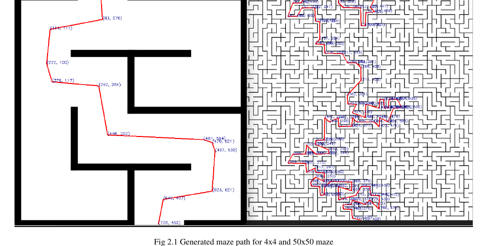

# Robot Arm Maze Solver

End-to-end system that photographs a physical maze, solves it with A*, and commands a 6-DOF robot arm to trace the solution path in the real world. The pipeline runs across Python (vision + pathfinding), MATLAB (inverse kinematics + trajectory generation), and a TCP socket interface to the Pro600 hardware.

---

## Demo

<p align="center">
  
</p>

Full video: https://github.com/Hp092/robot-arm-maze-solver/blob/main/DemoVideo.mp4

---

## A* Maze Solution

The A* solver generates an optimal path through the maze (left: 4×4, right: 50×50). Waypoint coordinates are exported to CSV and fed into the IK solver.

<p align="center">
  
</p>

---

## Pipeline Overview

```
Camera → A* Pathfinding → Waypoints CSV → IK Solver → Joint Angles CSV → Robot Hardware
  (maze.py)                               (FinalProject.m)               (robotControl.py)
```

1. **maze.py** — captures the maze from a webcam, binarizes it, runs A* with a distance-transform cost map to prefer paths away from walls, simplifies the route with Ramer–Douglas–Peucker, and saves pixel waypoints to `waypoints.csv`
2. **FinalProject.m** — loads the Pro600 URDF, maps pixel waypoints to robot workspace coordinates, solves inverse kinematics for each waypoint using MATLAB's Robotics Toolbox, generates a smooth trapezoidal velocity trajectory, simulates the arm, and exports joint angles to `ik_joint_angles.csv`
3. **robotControl.py** — reads the joint angle CSV and sends `set_angles(...)` commands over TCP to the physical robot at each waypoint

---

## Hardware

| Component | Details |
|---|---|
| Robot arm | Efort Pro600 — 6-DOF industrial arm |
| End effector | Link 6 (wrist) |
| Camera | Webcam (OpenCV capture) |
| Communication | TCP socket to robot controller |

---

## Software

| Layer | Technology |
|---|---|
| Maze solving | Python, OpenCV, A* with distance-transform cost |
| Path simplification | Ramer–Douglas–Peucker algorithm |
| Robot modeling | MATLAB Robotics Toolbox, URDF |
| Inverse kinematics | MATLAB `inverseKinematics` solver |
| Trajectory generation | Trapezoidal velocity profile (`trapveltraj`) |
| Hardware interface | Python TCP socket |

---

## Repository Structure

```
robot-arm-maze-solver/
├── FinalProject.m       # Main MATLAB script — IK, trajectory, simulation
├── csvimport.m          # CSV import helper used by FinalProject.m
├── maze.py              # Maze capture, A* solving, waypoint export
├── robotControl.py      # TCP interface to physical robot hardware
├── waypoints.csv        # Example solved maze waypoints (pixel coords)
├── JointAngles.csv      # Example output joint angles
├── FinalProject.pdf     # Project report
├── DemoVideo.mp4        # Full demo
└── URDF/
    ├── pro600.urdf      # Robot description
    ├── base.dae         # Base mesh
    ├── link1–6.dae      # Link meshes
    └── iksessiondata.mat  # IK session data
```

---

## Getting Started

**Requirements:** MATLAB R2023b+, Robotics Toolbox; Python 3 with `opencv-python`, `numpy`

### Step 1 — Solve the maze

```bash
python maze.py
```

Press `s` to capture the maze from the webcam. Click the start and end points. The solved path is saved to `waypoints.csv`.

### Step 2 — Generate joint angles

Open MATLAB in the project directory and run:

```matlab
FinalProject.m
```

This loads the URDF, runs IK on each waypoint, simulates the trajectory, and saves `ik_joint_angles.csv`.

### Step 3 — Run on hardware

Update `TARGET_IP` in `robotControl.py` to match your robot controller, then:

```bash
python robotControl.py
```

---

## Author

**Harsh Padmalwar**
